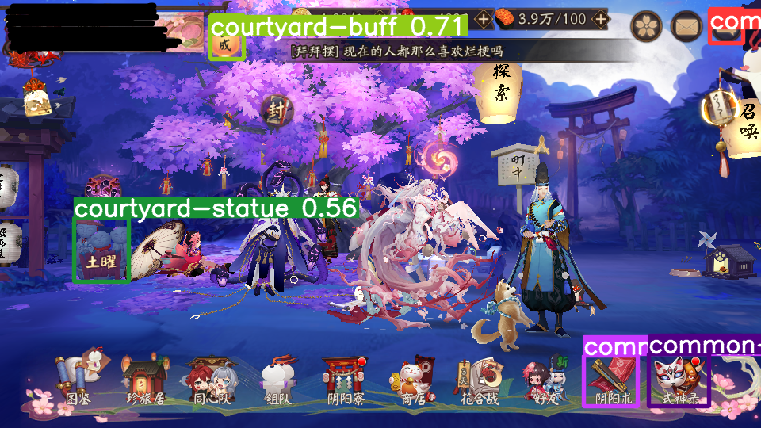
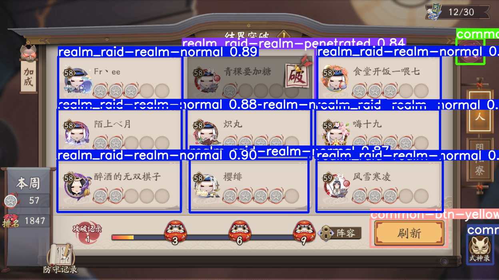

# YOLO-Games-Weights

_YOLOv5 vision deep-learning on detect games UI (current support: onmyoji)_

_YOLOv5深度学习识别游戏UI(目前支持：阴阳师)_


## Let’s try it! 开始

To start using YOLO-Games-Weights, you just need [YOLOv5](https://github.com/ultralytics/yolov5.git) installed.

要开始使用YOLO Games Weights，您需要先安装 [YOLOv5](https://github.com/ultralytics/yolov5.git)


```
# clone YOLOv5
git clone https://github.com/ultralytics/yolov5
cd yolov5
pip3 install -r requirements.txt  # install
# clone YOLO-Games-Weights as YOLOv5's submodule
git submodule add https://github.com/HarunoWindy/yolo-games-weights.git game-weights
```

_Already YOLOv5 & YOLO-Games-Weights installed?_

_已经安装了YOLOv5和YOLO-Games-Weights？_

```
# update YOLOv5 更新 YOLOv5
git pull
# update YOLO-Games-Weights 更新 YOLO-Games-Weights
git submodule update --init --recursive
```


## Inference 推理
Models can be used directly.

已经训练好的模型可以直接使用。

See the [YOLOv5](https://github.com/ultralytics/yolov5.git) Docs for full documentation on detecting and training.

推理和训练的详细文档见[YOLOv5](https://github.com/ultralytics/yolov5.git)。

```
# usage 用法
python detect.py --weights game-weights/<support game name>/train/<model date dir>/exp/weights/best.pt --source <your dataset path>
```


## Result & Example 成果举例

```
# example: detect onmyoji source 举例：推理阴阳师画面
python detect.py --weights game-weights/onmyoji/train/202212070422/exp/weights/best.pt --source game-weights/example --conf-thres 0.4 --iou-thres 0.55
```






## Train 训练

**Training will taking a long time and it is not required**

**已经训练好的模型可以直接使用无须训练，训练耗时较长**


### Append Train 追加训练

Train your own custom dataset with base model.

基于已有模型附加强化训练。
```
# usage 用法
python train.py --data <your yaml path> --weights game-weights/onmyoji/train/202212070422/exp/weights/best.pt --img 640 --batch-size <total batch size, depends your system memory, recommend 4, 8, 16> --epochs <total training epochs, recommend 800> --device <your device, recommend GPU>
# example
python train.py --data game-weights/onmyoji/train/202212070422/onmyoji.yaml --weights game-weights/onmyoji/train/202212070422/exp/weights/best.pt --img 640 --batch-size 8 --epochs 2000 --device 0
```


### Retrain 重新训练

Train your own custom dataset with empty model.

Dataset in version 202212070422(202212070422版训练使用的数据集)
https://pan.baidu.com/s/1lXsEhPW_6Y5ILbEaQpGHCA?pwd=q217


- [Train Custom Data](https://github.com/ultralytics/yolov5/wiki/Train-Custom-Data)
- [PyTorch](https://pytorch.org/)


## Label Class Table 标签类别对照表


- [Onmyoji Label Table 阴阳师标签表](./onmyoji/classLabel.md)
